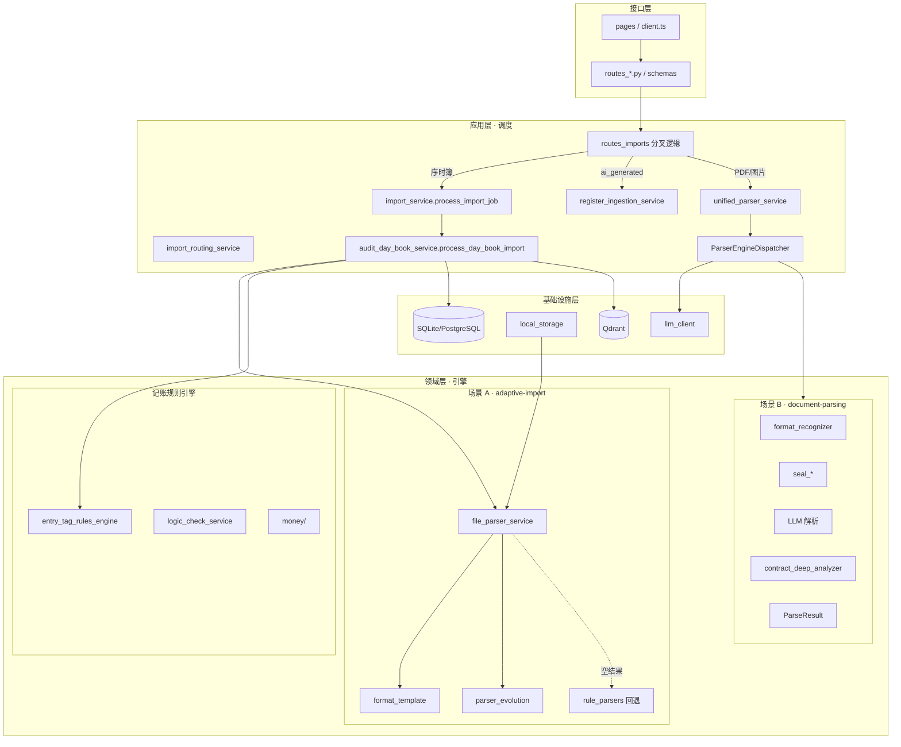

# DDD 四层架构与「调度 / 引擎」对照图

> **文档类型**: 架构真值对照（开发进展梳理）  
> **更新日期**: 2026-07-06  
> **依赖**: [code-truth-status.md](./code-truth-status.md)、[parser-dual-scenario-strategy.md](./parser-dual-scenario-strategy.md)、[core-business-concepts-boundary.md](./core-business-concepts-boundary.md)、[module-dependency-rules.md](./module-dependency-rules.md)  
> **代码基准**: `backend/app/` + `frontend/src/`（模块化单体，非物理分包 DDD）

---

## 一、本文用途

用 **DDD 经典四层** + **调度 / 引擎** 二分法，对照**当前代码落点**与**设计理念**（双场景解析 Charter），便于你判断：

1. 进展是否符合「场景 A 自适应导入 + 场景 B 分层解析 + 记账/审计闭环」预期；
2. 哪些文件属于哪一层、哪些是编排、哪些是能力内核；
3. 哪些是**已对齐**、哪些是**层次混杂的技术债**。

**重要说明**：项目是 **模块化单体**（`services/{domain}/`），**未**按 `interfaces/application/domain/infrastructure` 物理分包。下表是**逻辑归属** + **现状诚实标注**。

---

## 二、四层定义（本项目口径）

| 层 | DDD 职责 | 在本项目中的判断标准 |
|----|----------|----------------------|
| **接口层** | 对外协议、DTO、鉴权入口、页面与 API 绑定 | 只做请求/响应转换；**不应**含借贷平衡、解析模板等规则 |
| **应用层** | 用例编排、事务边界、跨域协调、工作流 | **调度** 主战场：决定走 A/B/登记哪条链、何时落库 |
| **领域层** | 业务规则、不变量、领域对象、策略 | **引擎** 主战场：解析、校验、映射、标签规则 |
| **基础设施层** | DB、文件、向量库、LLM/OCR、消息、配置 | 可替换技术实现；领域层通过服务函数调用（尚未全面 Repository 化） |

---

## 三、调度 vs 引擎（横切定义）

| 概念 | 定义 | 识别特征 |
|------|------|----------|
| **调度（Orchestrator）** | 按 `source_type`、文件类型、配置**选路**并串联多步 | `if/路由表/Dispatcher.process()`、组合 parse→validate→persist |
| **引擎（Engine）** | 对单一输入执行**可命名能力**，输出结构化结果 | `parse_*`、`apply_*_rules`、`embed_*`、模板匹配、LLM 调用封装 |

**产品级双场景与调度关系**（与 [parser-dual-scenario-strategy.md](./parser-dual-scenario-strategy.md) 一致）：

```text
接口层 API/页面
    ↓
应用层 · 导入调度中枢
    ├─ source_type ∈ {ledger_day_book, audit_day_book}
    │     → 场景 A 引擎链 → 直接分录（direct_entries）
    ├─ source_type = ai_generated
    │     → 登记调度链（register_ingestion）【现状；非 ParserEngineDispatcher】
    └─ 其他原始资料（PDF/图片等）
          → 场景 B：unified_parser_service → ParserEngineDispatcher → 草稿/台账
```

---

## 四、接口层（Interface）

### 4.1 后端

| 路径 | 职责 | 备注 |
|------|------|------|
| `backend/app/api/routes_*.py`（53 个） | HTTP 端点、依赖注入、薄封装 | 理想：只调应用服务；部分 route **含编排逻辑** ⚠️ |
| `backend/app/schemas/*.py` | 请求/响应 DTO（Pydantic） | 纯接口契约 |
| `backend/app/main.py` | 应用启动、路由注册、中间件 | 组合根（Composition Root） |
| `backend/app/api/deps.py`（如有） | `get_db`、`get_current_user` | 接口层横切 |

**按业务域分组（摘要）**：

| 域 | 代表路由文件 |
|----|-------------|
| 导入/解析 | `routes_imports.py`, `routes_parser_engine.py`, `routes_parser_voucher.py`, `routes_document_parsing.py`, `routes_unified_import.py`, `routes_parse_correction.py`, `routes_parser_evolution.py` |
| 记账 | `routes_vouchers.py`, `routes_entries.py`, `routes_accounting_periods.py`, `routes_reports.py`, `routes_entry_generation.py` |
| 审计 | `routes_audit_*.py`, `routes_workpapers.py`, `routes_audit_tests.py`, `routes_audit_export.py` |
| 组织/基础 | `routes_auth.py`, `routes_team.py`, `routes_project.py`, `routes_ledger.py`, `routes_coa.py`, `routes_entities.py` |
| 标签/AI | `routes_entry_tags.py`, `routes_document_tags.py`, `routes_agent.py`, `routes_llm_resolution.py` |

### 4.2 前端

| 路径 | 职责 |
|------|------|
| `frontend/src/pages/**` | 页面级用例入口（Step1–6、账簿、审计、解析管理） |
| `frontend/src/components/**` | 可复用 UI |
| `frontend/src/api/client.ts` | API 客户端（协议适配） |
| `frontend/src/services/DocumentParserService.ts` | 前端侧解析 API 封装 |
| `frontend/src/stores/**` | 认证等 UI 状态 |
| `frontend/src/layout/**`, `App.tsx` | 壳与路由 |

**与解析相关的关键页面（接口层）**：

| 页面 | 用户场景 | 实际调用的后端链 |
|------|----------|------------------|
| `AccountingMode/Step2ImportSource.tsx` | 记账 Step2 序时簿/原始资料 | `import-jobs` + `process/sync`（**场景 A 或登记**） |
| `AuditMode/Step2ImportSource.tsx` | 审计 Step2 | 同上 |
| `ParserEngineManagementPage.tsx` | 场景 B 调试台 | `/api/parser-engine/*` |
| `ParserVoucherPreview.tsx` | 解析→草稿预览 | `/api/parser-voucher/*` |
| `DraftPage.tsx` | 草稿复核 | `draft_data` / 分录 API |

---

## 五、应用层（Application）— 调度为主

### 5.1 跨域 / 共享调度

| 文件 | 调度职责 | 层纯度 |
|------|----------|--------|
| `services/doc_parsing/import_routing_service.py` | `source_type` → `direct_entries` / `register_ledger` | 领域策略，体量小 |
| `services/doc_parsing/import_service.py` | `process_import_job`、序时簿/凭证/源文件分流 | **应用**（混有落库编排） |
| `services/doc_parsing/unified_import_service.py` | 旧统一导入门面 | 应用（待 deprecated） |
| `services/shared/ledger_context_service.py` | 补全 `ledger_id`、账簿上下文 | 应用 |
| `services/shared/ledger_management_service.py` | 账簿生命周期 | 应用 |
| `services/project_service.py` | 项目与账簿关联 | 应用 |

### 5.2 解析域调度

| 文件 | 调度职责 | 场景 |
|------|----------|------|
| `api/routes_imports.py` | `/files/{id}/parse`、`/process/sync` **路由中枢** | A / 登记 / B 分叉 |
| `services/doc_parsing/parser_engine/unified_parser_service.py` | 场景 B 门面：文件 → Dispatcher → `draft_data` | B |
| `services/doc_parsing/parser_engine/parser_engine_dispatcher.py` | **场景 B 主调度器**（Step0–7 选策略） | B 调度 |
| `services/basic_data/register_ingestion_service.py` | 发票/流水/合同 → 模块台账 | B 出口 · 登记子路径 |
| `services/doc_parsing/async_parsing_service.py` | 大批量解析异步任务调度 | 基础设施向应用 |

### 5.3 序时簿 / 记账应用编排

| 文件 | 调度职责 |
|------|----------|
| `services/audit/audit_day_book_service.py` | **parse → 分组 → 平衡校验 → 落库 → 标签/向量**（编排为主，内含领域规则 ⚠️混杂） |
| `services/accounting/voucher_service.py` | 凭证创建/过账工作流 |
| `services/accounting/entry_generation_service.py` | AI/规则生成分录编排 |
| `services/accounting/period_close_service.py` | 结账状态机编排 |
| `services/doc_parsing/parser_voucher_mapper.py` | 文档类型 → 映射函数 **调度表** |

### 5.4 审计 / Agent 调度

| 文件 | 调度职责 |
|------|----------|
| `services/audit/audit_workflow_service.py` | 审计流程 |
| `services/audit/audit_task_service.py` | 任务分配与状态 |
| `services/agent/agent_orchestration_service.py` | 尽调 Agent 计划编排 |
| `services/agent/agent_tool_execution_service.py` | 工具调用编排 |

---

## 六、领域层（Domain）— 引擎与规则为主

### 6.1 场景 A · 结构化自适应导入引擎

| 文件 | 引擎职责 | Spec 归属 |
|------|----------|-----------|
| `services/doc_parsing/file_parser_service.py` | **`parse_structured_accounting_entries`** 统一入口：表头检测、模板、合计行过滤、规则回退 | `adaptive-import-engine` |
| `services/doc_parsing/format_template.py` | 模板检测与列映射 | A |
| `services/doc_parsing/parser_engine/parser_evolution_service.py` | 列别名进化规则 | A |
| `services/doc_parsing/parser_engine/rule_parsers.py` | 规则表解析（亦被 B 复用） | A 回退 / B Step2 |
| `services/doc_parsing/parser_engine/field_alias_catalog.py` | 字段别名目录 | A/B 共享 |

### 6.2 场景 B · 原始资料分层解析引擎

| 文件 | 引擎职责 | Charter 层级 |
|------|----------|--------------|
| `parser_engine/format_recognizer.py` | Step 0 格式识别 | 0 |
| `basic_data/seal_*_service.py` | Step 1 印章检测/OCR | 1 |
| `parser_engine/rule_parsers.py` | Step 2 格式/规则层 | 2 |
| `parser_engine` 内 LLM 解析函数 | Step 3 非标层 | 3 |
| `parser_engine/contract_deep_analyzer.py` | 合同深度语义 | 3 |
| `parser_engine/parser_engine_analyzer.py` | Step 5 双引擎融合分析 | 5 |
| `parser_engine/parse_result.py` | Step 6 统一 `ParseResult` 模型 | 6 |
| `parser_engine/correction_loop_service.py` | 修正回流规则 | 修正闭环 |
| `parser_engine/parse_quality_metric_service.py` | 质量指标领域 | 验收 |

### 6.3 记账 / 标签 / 校验引擎

| 文件 | 引擎职责 |
|------|----------|
| `services/accounting/entry_tag_rules_engine.py` | 分录自动标签规则引擎 |
| `services/tag_mapping_rule_service.py` | 标签映射规则 |
| `services/logic_check_service.py` | 凭证字/摘要逻辑校验 |
| `services/shared/data_validator.py` | 通用数据校验规则 |
| `backend/app/money/` | 金额值对象与精度规则 |
| `audit_day_book_service` 内 | 借贷平衡、跳号检测、凭证分组（**领域规则**，与编排同文件 ⚠️） |

### 6.4 领域模型（实体 / 值对象）

| 文件 | 说明 |
|------|------|
| `backend/app/db/models.py` | SQLAlchemy 实体（偏贫血模型） |
| `backend/app/models/*.py` | 部分独立模型（如 parse_correction） |
| `parser_engine/parse_result.py` | 解析领域对象 |

---

## 七、基础设施层（Infrastructure）

| 路径 | 职责 |
|------|------|
| `backend/app/db/session.py` | 数据库 Session 工厂 |
| `backend/alembic/` | 迁移 |
| `backend/app/storage/local_storage.py` | 文件存储、`resolve_storage_path` |
| `services/doc_parsing/vector_store_service.py` | Qdrant 客户端封装 |
| `services/doc_parsing/embedding_service.py` | 向量嵌入 |
| `services/doc_parsing/ocr_service.py` | OCR |
| `services/agent/llm_client_service.py` | LLM HTTP 客户端 |
| `services/agent/ai_client_service.py` | AI 服务适配 |
| `backend/app/core/config.py` | 环境配置 |
| `services/auth/auth_service.py` | JWT / 密码哈希（偏基础设施） |
| `deploy/`、`docker-compose` | 部署与运行时 |

---

## 八、全景对照图（逻辑四层 + 双场景）



---

## 九、与设计理念的对齐度评估（供你核对预期）

### 9.1 已符合预期的部分 ✅

| 设计预期 | 代码现状 | 证据 |
|----------|----------|------|
| 场景 A 与 B **分路** | `import_routing` + `routes_imports` 按 `source_type` 分叉 | 序时簿不走 `ParserEngineDispatcher` |
| 场景 A 主引擎 | `parse_structured_accounting_entries` 统一入口 | `file_parser_service.py` |
| 场景 B 分层 + 调度 | `ParserEngineDispatcher` Step 0–7 | `parser_engine_dispatcher.py` |
| 双场景 **出口分流** | 直接分录 / 台账登记 / parser 草稿 | `get_import_output_path` |
| 领域模块化 | `services/{accounting,audit,doc_parsing,...}/` | [code-truth-status.md §2.1](./code-truth-status.md) |
| 修正回流方向 | `correction_loop_service`、`ParseCorrectionRule` | L3–L4 已落地 |

### 9.2 部分符合 / 需认知 ⚠️

| 设计预期 | 差距 | 影响 |
|----------|------|------|
| DDD **物理分层** | 应用与领域混在同一 `*_service.py` | 可维护性；不符合教科书 DDD，但符合「模块化单体」阶段 |
| 场景 B Step2（`ai_generated`）走 Dispatcher | 实际走 `register_ingestion` + `classify_document` | 与 Charter Step 0–7 **未完全对齐**；功能可用 |
| 「统一解析引擎」单一品牌 | 实际三条链：A / 登记 / B | **产品文案**误导（见双场景审计结论） |
| `engine-architecture.md` | 仍写「单一导入解析引擎」 | 文档落后于 [parser-dual-scenario-strategy.md](./parser-dual-scenario-strategy.md) |
| API 收敛 | 5 条导入相关链路并存 | `import-jobs` / `parse` / `unified-import` / `parser-engine` |

### 9.3 尚未达到预期的部分 ❌ / 待办

| 项 | 说明 |
|----|------|
| Charter **Step 4 背景层**系统化注入 | `context` 字段有，未形成独立领域服务 |
| 解析 **96% 稳定性** L6 验收 | code-truth：未达标 |
| 全量 pytest 绿 | 618/666，未全绿 |
| 接口层零业务逻辑 | 部分 `routes_*.py` 仍含分支与组装 |
| Repository 模式 | 领域直接依赖 SQLAlchemy Session |

---

## 十、按目录速查表（开发时查层）

| 目录 / 文件模式 | 主层 | 调度/引擎 |
|-----------------|------|-----------|
| `app/api/` | 接口 | — |
| `app/schemas/` | 接口 | — |
| `frontend/src/pages/` | 接口 | — |
| `import_routing_service.py` | 应用 | 调度 |
| `import_service.py` | 应用 | 调度 |
| `routes_imports.py`（process/parse） | 应用+接口 | 调度 |
| `unified_parser_service.py` | 应用 | 调度（B） |
| `parser_engine_dispatcher.py` | 应用 | **调度（B 核心）** |
| `file_parser_service.py` | 领域 | **引擎（A 核心）** |
| `rule_parsers.py` | 领域 | 引擎（A 回退 / B 规则层） |
| `audit_day_book_service.py` | 应用+领域 | 调度+规则（宜未来拆分） |
| `entry_tag_rules_engine.py` | 领域 | 引擎 |
| `register_ingestion_service.py` | 应用 | 调度（登记出口） |
| `db/models.py` | 领域（实体） | — |
| `storage/`, `vector_store`, `llm_client` | 基础设施 | — |

---

## 十一、维护规则

1. 新增解析能力：先标明 **场景 A 或 B**，再决定进 `file_parser_service` 还是 `parser_engine/`。
2. 新增 API：先进 `routes_*.py`（接口），编排进 `*_service.py`（应用），规则进引擎文件（领域）。
3. 本文与 [parser-dual-scenario-strategy.md](./parser-dual-scenario-strategy.md) 冲突时，以 **Charter + 代码** 为准，并回写本文。
4. [backend/docs/engine-architecture.md](../../backend/docs/engine-architecture.md) 已增补 **双场景与 DDD 对照** 章节指针，逐步替代其「单引擎」叙述。

---

## 十二、一句话结论（给你做进展判断）

**业务路由与双场景引擎划分已基本符合 Charter**；**DDD 四层在逻辑上可辨认，但物理上仍是「领域模块化单体 + 服务文件内混层」**。当前主要偏差不在「选错引擎」，而在 **登记子路径未纳入 B Dispatcher**、**文案/旧文档未对齐**、**API 与测试未收敛**。这与「并行可用 + 修正回流为王」的产品哲学 **一致**，与「教科书式干净 DDD 分包」 **尚未一致**——若你的预期是后者，需单列重构 Sprint；若预期是双场景可用，则 **核心解析主线进展符合预期**。
