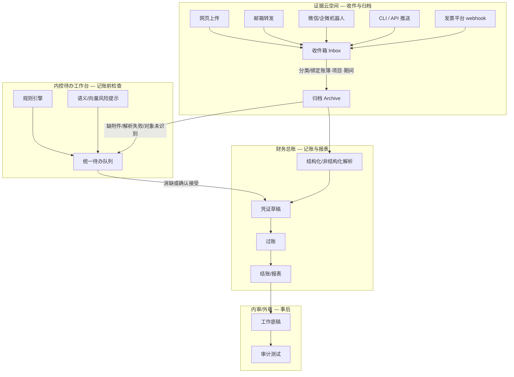

# 证据云空间 × 内控待办工作台 — 产品规格（草案）

> 状态：草案 · 待产品确认后分阶段实施  
> 关联：`ledger-supporting-files-workpaper-boundary-plan.md`、`internal-control-audit/spec.md`、`parser-dual-scenario-strategy.md`

## 1. 背景：两个「尴尬页面」的根因

| 现名 | 路由 | 用户感受 | 根因 |
|------|------|----------|------|
| 支持性文件 | `/ledger/files` | 像文件列表，不像「工作起点」 | 上传入口在 Step2 导入；本页只有浏览/改元数据；归档路径写在 JSON notes 里，无真实云空间感 |
| 内控缺陷清单 | `/ledger/control-defects` | 像事后补丁，不像「工作待办」 | v1 仅一条硬编码规则（银行户名不规范）；与风险列表、维度待办、AuditTask 四套系统并行，未统一 |

**产品结论**：二者不应是「账簿侧边栏里的附属页」，而应分别是：

1. **证据云空间（Evidence Cloud）** — 记账之前的**资料收件与归档层**
2. **内控待办工作台（ICF Workbench）** — 正式内审之前的**规则/语义驱动的待办层**

财务总账（凭证、过账、报表、结账）位于二者**之后**，消费已归档、已消缺（或已确认接受风险）的结构化/非结构化证据。

---

## 2. 目标用户旅程（端到端）



**原则**：

- 云空间里的是**不可篡改原件**（WORM 或版本链）；允许改分类、标签、关联，不改文件本体。
- 内控待办是**可关闭的任务**（确认/误报/已整改），不是只读缺陷表。
- 总账只引用「已归档 + 待办已处理或已豁免」的资料生成凭证。

---

## 3. 模块 A：证据云空间（Evidence Cloud）

### 3.1 产品定位

每个**账簿**（及可选**项目**）拥有一个逻辑「云空间」：

- **收件箱**：尚未完成分类/绑定的文件（多通道汇入的第一站）
- **归档库**：已绑定 `ledger_id` + `project_id` + `period_code` + `archive_category` 的支持性文件
- **解析状态**：待解析 / 解析中 / 已结构化 / 仅文本 / 失败

用户心智：**先把票、合同、流水「扔进来」，再整理进柜子，最后才记账。**

### 3.2 接入通道（分阶段）

| 阶段 | 通道 | 说明 |
|------|------|------|
| P0 | 网页拖拽上传 | 云空间页直接上传，不经过 Step2 |
| P0 | 导入作业（现有） | 保留 Step2 批量导入，汇入同一 Inbox |
| P1 | REST ingest API | `POST /api/evidence/ingest` + ledger token，供 CLI/脚本 |
| P1 | 专用邮箱 | `ledger-{id}@ingest.{domain}` → 附件落 Inbox |
| P2 | 微信/企微 | 企业机器人转发文件 → ingest webhook |
| P2 | 发票推送 | 电子发票平台 OAuth + webhook |
| P3 | 对象存储同步 | S3/OSS 桶前缀监听（大客户） |

### 3.3 数据模型演进（在 `SourceFile` 上扩展）

新增概念（可不立刻拆表，先用 `notes` + 枚举字段过渡）：

```text
EvidenceIngestChannel: web | import_job | email | wechat | api | invoice_platform
EvidenceLifecycle: inbox | archived | linked_to_voucher | superseded
StorageBackend: local | s3 | oss  （默认 local，生产切对象存储）
```

必填关联：

- `ledger_id`（核算边界）
- 归档后：`project_id`、`period_code`、`archive_category`（合同/发票/银行回单/其他）

### 3.4 与财务总账的接口

| 下游 | 消费方式 |
|------|----------|
| 场景 A 序时簿 | 结构化 Excel/CSV 归档 → 直接生成 `AccountingEntry` |
| 场景 B 原始资料 | PDF/图片 → OCR/语义 → 模块台账 → 凭证草稿 |
| 凭证行 | `VoucherLine.source_file_id` 回链原件 |
| 工作底稿 | `WorkpaperVersion.source_file_id`（加工成果，非原件） |

**总账页不直接列文件**；从凭证/分录「查看支持性文件」跳转云空间归档视图。

### 3.5 页面改造（`/ledger/files` → `/ledger/evidence`）

| 区域 | 内容 |
|------|------|
| 顶栏 | 账簿选择、空间用量、收件箱/归档切换 |
| 收件箱 | 待处理文件卡片：预览、识别类型、一键归档向导 |
| 归档库 | 文件夹树（项目/期间/类别）+ 列表/网格 |
| 上传区 | 拖拽 + 「复制邮箱地址」「API 密钥」「CLI 示例」 |
| 详情抽屉 | 原件预览、解析文本、已关联凭证、不可篡改提示 |

---

## 4. 模块 B：内控待办工作台（ICF Workbench）

### 4.1 产品定位

**内部审计的前置程序**：在整个记账与关账环节中，持续产出「待用户处理的提醒」，来源包括：

1. **规则引擎** — 可配置阈值与科目/tag 规则（复用并扩展 `AuditRisk`、`InternalControl`、`account-tag-rules`）
2. **语义识别** — 向量相似、摘要异常、对象名不规范、缺附件推断（复用 `risk_rule_service`、parser 输出）
3. **流程缺口** — 有发票无流水、有流水无发票、期间即将关闭仍有 open 待办

用户心智：**不是「缺陷台账」，而是「今天我该先处理什么」。**

### 4.2 统一待办模型（建议）

在现有 `AuditFinding` + `AuditTask` 之上增加统一 **WorkbenchItem** 视图（可先为 API 聚合层，不强制新表）：

```text
WorkbenchItem
  source: rule | semantic | dimension | internal_control | manual
  severity: info | warning | blocking
  category: master_data | evidence_gap | reconciliation | authorization | period_close
  title, description
  ledger_id, project_id, period_id?
  related_source_file_ids[], related_entry_ids[], related_finding_id?
  status: open | in_progress | resolved | waived | false_positive
  assignee?, due_date?
  suggested_action: 跳转链接 + 一键修复（如规范户名）
```

**blocking** 项在 P1 可配置为「阻止过账/关账」；P0 仅提醒。

### 4.3 规则来源整合（消除四套并行）

| 现有 | 并入工作台 |
|------|------------|
| `AuditFinding` (`internal_control`) | ✅ 内控类待办 |
| `AuditRisk` | ✅ 风险类待办 |
| `DimensionPendingQueue` | ✅ 主数据/维度类待办 |
| `ControlAlert`（API 已有、无 UI） | ✅ 控制活动告警 |
| `AuditTask`（手工） | 用户可从待办「升级为任务」指派他人 |

### 4.4 页面改造（`/ledger/control-defects` → `/ledger/workbench`）

| 区域 | 内容 |
|------|------|
| 摘要卡 | 待办总数 / 阻塞项 / 本周新增 / 已关闭 |
| 筛选 | 来源、严重度、期间、状态、经办人 |
| 列表 | 待办卡片：标题、建议操作、关联证据、一键跳转 |
| 详情 | 规则说明、证据链、处理记录、豁免理由 |
| 设置 | 规则开关、通知方式（后续） |

内控缺陷清单作为工作台的一个**筛选视图**（`category=internal_control`）保留，避免老用户迷路。

### 4.5 与内审的关系

```text
记账前：Workbench 消缺 → 凭证草稿质量更高
关账前：blocking 待办 = 0 或已豁免 → 允许结账
内审时：Workbench 历史 + 工作底稿 + 审计测试 → 正式内控测试底稿
```

后端已有 `InternalControl` / `ControlTest` 库，P2 再与行业模板、正式内控测试报告对接。

---

## 5. 实施分期（建议）

### Phase 0 — 口径与导航（进行中）

- [x] 导航改名：支持性文件 → **证据云空间**；内控缺陷清单 → **内控待办**
- [x] 产品决策写入规格（账簿主视图、仅通知、本地存储、企业自建 ingest）
- [x] 云空间页：**账簿主视图** + 上传入口 + 收件箱/归档库 Tab
- [x] 后端：`POST /api/files/ingest`、`POST /api/files/{id}/archive`、`lifecycle` 筛选
- [x] 工作台页聚合展示：内控 + 维度待办 + 风险（只读合并列表）

### Phase 1 — 云空间 MVP（2–3 周）

- [x] Inbox / Archived 两态生命周期
- [x] 归档向导（项目、期间、类别）
- [x] Ingest API + 示例（JWT 鉴权；`GET /api/files/ingest/example` + `scripts/evidence_ingest.py`）
- [x] 凭证/分录反查证据链接（`GET /api/entries/{id}/source-evidence` + 凭证查询「查看原件」）

### Phase 2 — 工作台 MVP（2–3 周）

- [x] Workbench 聚合 API（`GET /api/workbench/items`）
- [ ] 待办 → AuditTask 升级
- [ ] 扩展规则：缺附件、解析失败、期间关账前检查
- [ ] 户名不规范等现有规则迁入统一模型

### Phase 3 — 多通道与存储（按需）

- [ ] 邮箱 ingest
- [ ] 对象存储后端
- [ ] 微信/发票 webhook
- [ ] blocking 关账闸门

---

## 6. 非目标（本规格不做）

- 不替代 DMS/全文 ECM 的全部能力
- 不在 P0–P1 实现完整 SOX 内控测试底稿
- 不修改已结账期间的凭证逻辑（仅只读引用证据）

---

## 7. 产品决策（已确认 · 2026-07-12）

| 议题 | 决策 |
|------|------|
| 云空间主视图 | **账簿为主**，项目作为归档维度（筛选/文件夹路径） |
| 阻塞粒度 | **仅通知**，不强制阻止过账或关账；由客户自行决定处理节奏 |
| P1 存储 | **本地目录 + 虚拟文件夹**；后期规划 S3/OSS 同步 |
| 邮箱/微信 ingest | **每家企业自建 ingest 地址**（P2）；后期可选平台统一域名 |

---

## 8. 与现有代码映射（实施时参考）

| 能力 | 现有路径 |
|------|----------|
| 文件模型 | `backend/app/db/models.py` → `SourceFile` |
| 文件 API | `backend/app/api/routes_files.py` |
| 上传解析 | `backend/app/api/routes_imports.py` |
| 虚拟归档 | `backend/app/services/doc_parsing/draft_archive_service.py` |
| 内控 finding | `backend/app/services/audit/structured_import_service.py` |
| 内控 API（未接 UI） | `backend/app/api/routes_internal_controls.py` |
| 风险规则 | `backend/app/services/audit/risk_rule_service.py` |
| 审计任务 | `backend/app/api/routes_audit_tasks.py` |
| 支持性文件页 | `frontend/src/pages/LedgerFilesPage.tsx` |
| 内控缺陷页 | `frontend/src/pages/ControlDefectsPage.tsx` |
