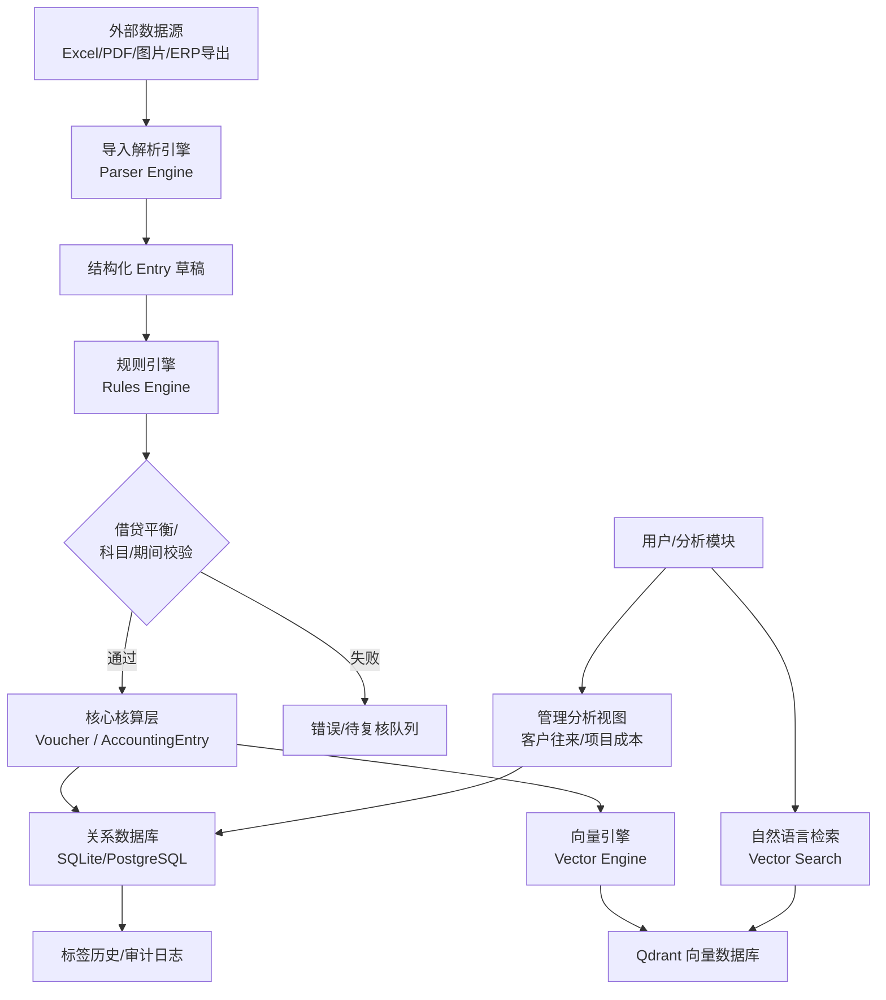
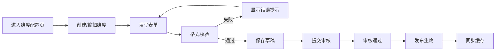
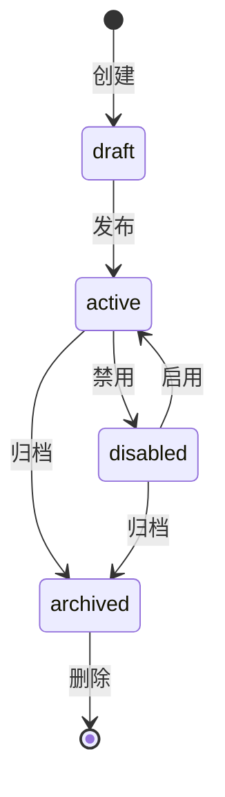
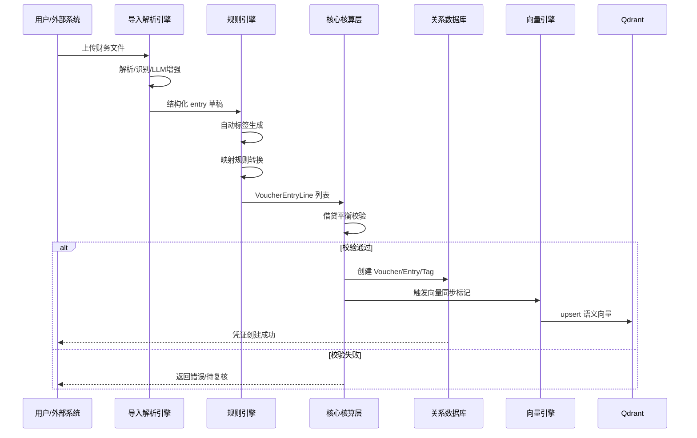
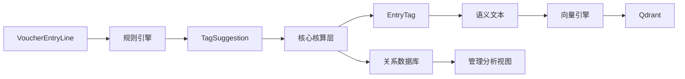

# 财务向量审计系统 - 引擎架构设计文档

> 文档编号：DOC-ENGINE-ARCH-001
> 版本：v1.0
> 适用范围：导入解析引擎、规则引擎、向量引擎及维度（Tag）配置机制
> 最后更新：2026-07-01

---

## 目录

1. [概述](#一概述)
2. [核心引擎定位](#二核心引擎定位)
3. [系统整体架构](#三系统整体架构)
4. [维度（Tag）配置机制](#四维度tag配置机制)
   - 4.1 维度定义规范
   - 4.2 数据类型约束
   - 4.3 配置界面交互流程
   - 4.4 与规则条件的关联方式
   - 4.5 维度值的来源与管理
   - 4.6 配置变更的生效机制
   - 4.7 权限控制策略
5. [引擎协同机制](#五引擎协同机制)
   - 5.1 统一数据对象
   - 5.2 接口规范
   - 5.3 调用顺序控制
   - 5.4 异常处理与降级策略
6. [关键技术说明](#六关键技术说明)
   - 6.1 规则的动态调整
   - 6.2 配置一致性与有效性保障
   - 6.3 高并发场景性能优化
7. [技术栈选型](#七技术栈选型)
8. [Mermaid 流程图](#八mermaid-流程图)

---

## 一、概述

本项目采用**“一级科目 + 维度（Tag）+ 向量语义”**的核心财务数据模型。传统财务软件中的二级科目、辅助核算项目被取消，统一由 Tag 体系承载。维度数据不仅用于管理分析、口径切换和内部考核指标，还通过向量化技术支撑尽调风险识别与自动预警分析。

本系统由三大引擎协同工作：

- **导入解析引擎（Import/Parser Engine）**：负责将外部非结构化/半结构化财务数据解析为结构化草稿。
- **规则引擎（Rules Engine）**：负责校验、补充语义、自动打标签、执行映射规则。
- **向量引擎（Vector Engine）**：负责语义编码、自然语言检索、风险相似度匹配。

三类引擎通过统一数据对象交互，功能边界清晰，异常降级可控。

---

## 二、核心引擎定位

### 2.1 导入解析引擎

| 项目 | 说明 |
|------|------|
| 核心职责 | 文件解析、字段识别、LLM 增强、双引擎对比、输出结构化 entry 草稿 |
| 输入 | Excel、PDF、图片、银行流水、ERP 导出文件 |
| 输出 | `List[Dict]` 结构化 entry 数据，包含 voucher_no、voucher_date、account_code、debit、credit、summary、counterparty 等 |
| 边界 | 只负责解析，不保证借贷平衡，不直接创建正式凭证 |
| 关键实现 | `backend/app/services/import_service.py`、`backend/app/services/parser_engine/` |

### 2.2 规则引擎

| 项目 | 说明 |
|------|------|
| 核心职责 | 会计规则校验、自动维度标签生成、映射规则转换、标签冲突消解 |
| 输入 | `VoucherEntryLine` 列表、原始 entry 字典、外部标签/二级科目编码 |
| 输出 | 校验结果、`TagSuggestion` 列表、映射后 Dimension |
| 边界 | 不修改会计金额和科目；标签为建议性质，可人工复核 |
| 关键实现 | `backend/app/services/entry_tag_rules_engine.py`、`backend/app/services/tag_mapping_rule_service.py`、`backend/app/services/voucher_service.py` |

### 2.3 向量引擎

| 项目 | 说明 |
|------|------|
| 核心职责 | 标签语义文本生成、embedding 编码、写入 Qdrant、自然语言检索 |
| 输入 | `EntryTag` + 关联 `AccountingEntry` |
| 输出 | 向量检索结果、相似度分数、关联凭证信息 |
| 边界 | 仅用于尽调、风险识别、语义关联；不参与确定性会计核算 |
| 关键实现 | `backend/app/services/entry_tag_vector_service.py`、`backend/app/services/vector_store_service.py` |

---

## 三、系统整体架构



---

## 四、维度（Tag）配置机制

> 注：本系统中的“维度”特指替代传统二级科目和辅助核算项目的 Tag 体系，用于口径切换、内部考核指标管理和自动预警分析。

### 4.1 维度定义规范

#### 4.1.1 命名规则

| 项目 | 规范 |
|------|------|
| 命名格式 | `snake_case`，小写字母、数字、下划线 |
| 字符限制 | 长度 1-60 字符，首字符必须为字母 |
| 唯一标识 | 同一 `ledger_id` 下 `code` 唯一；系统全局使用 `id`（自增主键） |
| 命名示例 | `counterparty`、`bank_account`、`business_type`、`project`、`department`、`tax`、`risk`、`entity_role` |

#### 4.1.2 层级关系

- 支持多级树形结构，通过 `parent_id` 关联父维度。
- `level` 字段自动计算：`level = parent.level + 1`。
- 子维度继承父维度的 `value_type` 和 `source_table`，但可单独覆盖。
- 删除父维度前必须清空子维度，避免级联误删。

#### 4.1.3 元数据结构

```python
class TagCategory(Base):
    id: int                    # 自增主键
    ledger_id: int             # 所属账簿
    parent_id: int | None      # 父维度 ID
    code: str(60)              # 维度编码，ledger 内唯一
    name: str(100)             # 维度显示名
    description: text          # 描述
    level: int                 # 层级深度
    value_type: str(40)        # text / entity / enum / number / date / boolean
    source_table: str(60)      # 主数据来源表名（可选）
    is_mandatory: bool         # 是否必填
    is_system: bool            # 是否系统内置
    status: str(20)            # active / disabled / archived
    sort_order: int            # 排序号
    created_at: datetime
    updated_at: datetime
```

---

### 4.2 数据类型约束

| 数据类型 | 存储类型 | 长度/精度限制 | 格式验证 | 示例 |
|----------|----------|---------------|----------|------|
| `text` | `VARCHAR(255)` | 1-255 字符 | 非空校验 | "山西岚县尚德鑫" |
| `entity` | `VARCHAR(255)` + `value_id` | 1-255 字符 | 必须关联主数据表 | counterparty_id=123 |
| `enum` | `VARCHAR(100)` | 1-100 字符 | 值必须在枚举列表中 | "销售收入" |
| `number` | `DECIMAL(18,4)` | 整数 14 位，小数 4 位 | 正则 `^-?\d+(\.\d+)?$` | 300000.0000 |
| `date` | `DATE` | 合法日期 | ISO 8601 格式 | 2026-01-15 |
| `boolean` | `BOOLEAN` | true/false | 严格布尔 | true |

**不支持的数据类型及处理策略：**

- 二进制文件：不允许作为维度值，需通过 `document` 表附件关联。
- JSON 对象：拆分为多个子维度或存入专门扩展表。
- 大文本：长度超过 255 字符的值应作为向量语义文本处理，不直接作为维度值。

---

### 4.3 配置界面交互流程

#### 4.3.1 操作路径



#### 4.3.2 表单设计

| 字段 | 类型 | 必填 | 默认值 | 说明 |
|------|------|------|--------|------|
| 编码 | input | 是 | - | 自动校验 snake_case |
| 显示名 | input | 是 | - | 中文名称 |
| 描述 | textarea | 否 | - | 业务说明 |
| 父维度 | select | 否 | 无 | 树形选择器 |
| 数据类型 | select | 是 | text | text/entity/enum/number/date/boolean |
| 数据来源 | select | 否 | 无 | 主数据表名 |
| 是否必填 | switch | 否 | false | - |
| 排序号 | number | 否 | 0 | - |
| 状态 | radio | 是 | active | active/disabled/archived |

#### 4.3.3 响应式与反馈

- 表单采用两列布局，移动端自动折叠为单列。
- 提交后显示 `loading` 状态，成功后 toast 提示并刷新列表。
- 编码重复、父维度循环、非法字符等错误实时显示在字段下方。

---

### 4.4 与规则条件的关联方式

维度通过 `category_id` 或 `code` 与规则条件绑定。

#### 4.4.1 条件结构

```json
{
  "rule_id": 1,
  "conditions": [
    {
      "category_code": "counterparty",
      "operator": "equals",
      "value": "山西岚县尚德鑫"
    },
    {
      "category_code": "amount_scale",
      "operator": "in",
      "value": ["百万级", "千万级"]
    }
  ],
  "logic": "AND"
}
```

#### 4.4.2 支持的运算符

| 运算符 | 说明 | 适用类型 |
|--------|------|----------|
| `equals` | 等于 | 全部 |
| `not_equals` | 不等于 | 全部 |
| `contains` | 包含 | text/entity |
| `not_contains` | 不包含 | text/entity |
| `in` | 在列表中 | enum/text |
| `not_in` | 不在列表中 | enum/text |
| `gt` / `gte` | 大于/大于等于 | number/date |
| `lt` / `lte` | 小于/小于等于 | number/date |
| `regex` | 正则匹配 | text |
| `is_empty` | 为空 | 全部 |

#### 4.4.3 组合逻辑

- 支持 `AND` / `OR` 嵌套组合。
- 默认根节点为 `AND`。
- 同一维度多个条件默认 `OR`。

---

### 4.5 维度值的来源与管理

#### 4.5.1 来源途径

| 来源 | 说明 | 示例 |
|------|------|------|
| 静态枚举 | 在配置界面维护枚举值列表 | `business_type`: 销售收入、采购支出 |
| 主数据表 | 关联 `Entity`、`Counterparty`、`Project` 等表 | `counterparty` 来自 counterparties |
| 外部 API | 调用第三方接口获取值列表 | 税务机关纳税人名录 |
| 文件导入 | 通过 Excel/CSV 批量导入维度值 | 客户清单导入 |
| 规则推导 | 根据规则引擎从摘要/科目自动提取 | 从摘要提取 `project` |

#### 4.5.2 生命周期状态



---

### 4.6 配置变更的生效机制

#### 4.6.1 发布流程

| 角色 | 操作 |
|------|------|
| 维度配置员 | 创建/编辑维度，保存草稿 |
| 规则管理员 | 审核维度定义及关联规则 |
| 系统管理员 | 发布生效 |

#### 4.6.2 版本控制

- 每次发布生成新版本号：`v{major}.{minor}.{patch}`，如 `v1.2.3`。
- `major`：维度结构变更；`minor`：新增维度或规则；`patch`：描述/排序调整。
- 版本历史记录：变更人、变更时间、变更内容、回滚目标版本。
- 回滚机制：通过 `TagCategory.status=archived` + 恢复上一版本记录实现。

#### 4.6.3 生效机制

- **即时生效**：发布成功后清除 `tag_category_service._category_cache`，下次读取自动加载最新配置。
- **定时生效**：可配置 `effective_at` 字段，系统定时任务扫描并切换状态。
- **状态监控**：通过 `TagCategory.status` 和日志表监控生效状态。

---

### 4.7 权限控制策略

| 角色 | 创建 | 编辑 | 删除 | 查看 | 发布 | 审核 |
|------|------|------|------|------|------|------|
| 系统管理员 | ✓ | ✓ | ✓ | ✓ | ✓ | ✓ |
| 维度配置员 | ✓ | ✓ | ✗ | ✓ | ✗ | ✗ |
| 规则管理员 | ✗ | ✗ | ✗ | ✓ | ✗ | ✓ |
| 普通查看者 | ✗ | ✗ | ✗ | ✓ | ✗ | ✗ |

权限验证通过 FastAPI 依赖注入实现，校验用户角色与维度操作权限矩阵。

---

## 五、引擎协同机制

### 5.1 统一数据对象

#### 5.1.1 `VoucherEntryLine`

```python
class VoucherEntryLine:
    account_code: str
    account_name: str | None
    summary: str | None
    debit_amount: Decimal
    credit_amount: Decimal
    counterparty: str | None
    counterparty_id: int | None
    entity_id: int | None
    source_file_id: int | None
    original_row: dict
    normalized_text: str
    tags: list[dict] = []
```

#### 5.1.2 `TagSuggestion`

```python
@dataclass
class TagSuggestion:
    category_code: str
    tag_value: str
    display_name: str
    weight: float
    confidence: float
    tag_source: str = "rule"
    value_id: int | None = None
```

#### 5.1.3 语义文本

```text
维度:counterparty 标签值:山西岚县尚德鑫 摘要:销售商品 科目:1122 科目名:应收账款 往来单位:山西岚县尚德鑫 日期:2026-01-15 金额:300000 凭证号:PZ-001
```

---

### 5.2 接口规范

| 调用方 | 被调用方 | 接口函数/类 |
|--------|----------|-------------|
| 导入解析引擎 | 规则引擎 | `entry_tag_rules_engine.apply_auto_tags_to_entries()` |
| voucher_service | 规则引擎 | `entry_tag_rules_engine.apply_auto_tags_to_voucher_lines()` |
| voucher_service | 核算层 | `entry_tag_service.create_entry_tag()` |
| 任意模块 | 向量引擎 | `EntryTagVectorService.sync_pending()` / `.search()` |
| 分析视图 | 关系数据库 | `analytics_service.analyze_counterparty()` / `.analyze_project_cost()` |

---

### 5.3 调用顺序控制



---

### 5.4 异常处理与降级策略

| 引擎 | 异常场景 | 处理方式 |
|------|----------|----------|
| 导入解析引擎 | 解析失败 | 记录失败原因，不进入后续引擎 |
| 导入解析引擎 | 置信度低 | 标记待复核，降低标签 confidence |
| 规则引擎 | 借贷不平衡 | 阻断凭证创建，返回错误 |
| 规则引擎 | 映射规则未命中 | fallback 默认分类或保留原标签 |
| 向量引擎 | Qdrant 不可用 | `safe_vector_store()` 返回 None，不影响主流程 |
| 向量引擎 | embedding 失败 | 保持 `vector_pending=True`，下次重试 |

---

## 六、关键技术说明

### 6.1 规则的动态调整

#### 6.1.1 设计原则

维度配置变更后无需重启系统即可生效。通过内存缓存 + 数据库持久化 + 缓存失效机制实现热更新。

#### 6.1.2 关键伪代码

```python
# backend/app/services/tag_category_service.py

_category_cache: dict[tuple[int, str], int] = {}

def get_category_by_code(db, ledger_id, code):
    cache_key = (ledger_id, normalize(code))
    if cache_key in _category_cache:
        category = db.get(TagCategory, _category_cache[cache_key])
        if category:
            return category
    category = db.query(TagCategory).filter_by(ledger_id=ledger_id, code=code).first()
    if category:
        _category_cache[cache_key] = category.id
    return category

def publish_category_change(db, category_id):
    category = update_category(db, category_id, status="active")
    # 清除缓存，使新配置立即生效
    _category_cache.pop((category.ledger_id, category.code), None)
    # 可选：发布事件通知其他节点
    publish_event("category.changed", {"ledger_id": category.ledger_id, "code": category.code})
```

#### 6.1.3 安全保障

- 缓存只保存 ID，不保存完整对象，避免跨 session 对象失效问题。
- 发布前进行配置校验，非法配置不允许发布。
- 支持版本回滚，发布异常可快速恢复。

---

### 6.2 配置一致性与有效性保障

#### 6.2.1 校验机制

| 校验类型 | 说明 |
|----------|------|
| 格式校验 | code 必须 snake_case，name 非空，value_type 在枚举范围内 |
| 业务规则校验 | 同一 ledger 下 code 唯一，父维度不能是自身子级 |
| 依赖关系校验 | 删除维度前检查是否被 EntryTag/规则引用 |

#### 6.2.2 事务控制

所有维度配置更新在数据库事务中执行，保证原子性：

```python
with db.begin():
    category = create_category(db, ...)
    create_mapping_rules(db, category.code, ...)
    create_audit_log(db, ...)
```

#### 6.2.3 冲突解决

- **并发修改**：数据库唯一约束 + 乐观锁（`updated_at` 版本检查）。
- **依赖冲突**：删除维度时检查依赖，存在依赖则禁止删除并返回冲突列表。

---

### 6.3 高并发场景性能优化

#### 6.3.1 缓存策略

- **维度分类缓存**：`_category_cache` 进程内字典，按 `(ledger_id, code)` 缓存 ID。
- **缓存更新**：配置发布时清除对应 key；全量更新时调用 `clear_category_cache()`。
- **缓存失效**：服务重启自动失效；定期 TTL 可扩展为 Redis。

#### 6.3.2 查询优化

- 索引：`entry_tags(entry_id, category_id)`、`entry_tags(ledger_id, category_id, tag_value)`。
- 分析视图使用 SQL `GROUP BY` 聚合，避免 N+1 查询。
- 分页：明细钻取 API 支持 `offset`/`limit`。

#### 6.3.3 资源隔离

- 向量同步使用独立线程/任务队列，避免阻塞主请求。
- 数据库连接池配置合理大小。
- 关键 API 加入请求限流（rate limiting）。

---

## 七、技术栈选型

| 层级 | 技术 | 说明 |
|------|------|------|
| 后端框架 | FastAPI + Python 3.11 | 异步 API 框架，自动生成 OpenAPI |
| ORM | SQLAlchemy 2.0 | 类型化模型，支持 PostgreSQL/SQLite |
| 数据库 | SQLite（开发）/ PostgreSQL（生产） | 关系型数据存储 |
| 向量数据库 | Qdrant | 标签语义向量存储与检索 |
| embedding | sentence-transformers / OpenAI | 语义文本编码 |
| 前端 | React + Vite + Ant Design | 管理界面与分析视图 |
| 缓存 | 进程内 dict（可扩展 Redis） | 维度分类缓存 |
| 任务队列 | 可扩展 Celery/APScheduler | 向量同步异步化 |

---

## 八、Mermaid 流程图

### 8.1 系统整体架构图


### 8.2 导入解析 → 规则引擎 → 核算层流程


### 8.3 维度配置发布流程


### 8.4 维度生命周期状态图


### 8.5 引擎协同数据流



---

## 附录：关键文件索引

| 文件 | 说明 |
|------|------|
| `backend/app/services/entry_tag_rules_engine.py` | 标签规则引擎 |
| `backend/app/services/tag_category_service.py` | 维度分类服务 |
| `backend/app/services/tag_mapping_rule_service.py` | 映射规则服务 |
| `backend/app/services/entry_tag_service.py` | 分录标签服务 |
| `backend/app/services/entry_tag_vector_service.py` | 标签向量服务 |
| `backend/app/services/analytics_service.py` | 分析视图服务 |
| `backend/app/services/voucher_service.py` | 核心凭证服务 |
| `backend/app/services/import_service.py` | 导入解析服务入口 |
| `backend/app/db/models.py` | 数据模型定义 |
| `backend/docs/ENTRY_TAGS_API.md` | EntryTag API 文档 |
