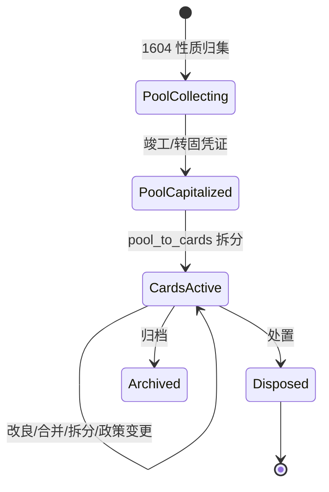

# 固定资产卡片台账（fixed_asset_register）表结构草案

> **文档性质**：Schema 草案（设计评审用，尚未 Alembic 落地）  
> **版本**：0.3-draft（全生命周期：在建池 → 竣工拆卡 → 动态变更 + 多勾稽点）  
> **依据**：[tag-vs-account-hierarchy.md §1.1–§1.2](./tag-vs-account-hierarchy.md)  
> **决策记录**：[fixed-asset-v1-decision-record.md](./fixed-asset-v1-decision-record.md)（v1.0 范围与兼容性，**当前不开发**）  
> **状态**：决策已定 → 待 v1.0 开发时写 migration + `module_register` 接入

---

## 1. 设计目标

| 目标 | 说明 |
|------|------|
| **Register 只存核心** | 卡片号、原值、启用日、折旧政策、生命周期状态 |
| **语义走 Tag** | `fixed_asset_class` / `fixed_asset_item`、部门、项目等 **不建列**，经 `capitalization_entry_id` → `entry_tags` 读取 |
| **金额以分录为准** | 卡片原值/累计折旧与资本化、折旧 **分录勾稽**；差异进待处理，不替代总账 |
| **过程留痕、多处勾稽** | 合并/分摊/拆分/再合并/年限变更/加速折旧/资本化改良 — **事件链 + 分录链接**；每阶段与 GL 核对，差异进内控缺陷 |

**不变量（贯穿全生命周期）**：

1. 金额真值在 **分录**；池/卡片仅为 Register 运行与勾稽视图。  
2. 固定资产定义 **相对动态**（准则允许的改良、替换、重估、年限变更）→ 用 **事件 + 政策版本** 表达，不覆盖历史。  
3. **唯一不变的是留痕与勾稽**，不是卡片字段 frozen 不变。

---

## 2. 表一览

| 表名 | 用途 |
|------|------|
| `fixed_asset_cip_pools` | **在建工程成本池**（竣工前按性质/项目归集，尚未卡片化） |
| `fixed_asset_pool_entry_links` | 成本池 ↔ 1604 等分录勾稽 |
| `fixed_asset_register` | 固定资产卡片主表（竣工拆卡 / 直接购入后） |
| `fixed_asset_entry_links` | 卡片 ↔ 分录多对多勾稽 |
| `fixed_asset_card_events` | 拆分/合并/转固/改良/政策变更等 **事件留痕** |
| `fixed_asset_depreciation_policies` | 折旧政策 **版本链**（年限/方法变更不抹历史） |

**刻意不建**：资产类别表、部门/项目冗余列、独立向量标签表（复用 `entry_tags` + Qdrant）。

---

## 2.1 全生命周期模型（业务叙事）

典型场景：**某厂整体投资 8000 万**，建设期很长，初期只有按 **性质** 归集的在建（车间、材料、人工、资本化利息等），**尚未形成可独立折旧的具体资产**；**竣工投产**后，才按管理口径（如「三期扩产」项目、产线、建筑物）**拆分为多张卡片**。投产后仍有 **维修/替换/扩建增加原值**、**折旧年限变更/加速/剩余年限重算** 等路径。

```text
阶段 1  归集（无卡片或仅有池）
  1604 分录 + Tag(cip_project=三期扩产, cost_element=材料|人工|资本化利息…)
       ↓ 挂接
  fixed_asset_cip_pools（8000万池，status=collecting）

阶段 2  竣工转固 / 拆卡
  验收竣工 → card_events(pool_to_cards)
       ↓
  多张 fixed_asset_register（按管理粒度：产线A、厂房、污水处理…）
  各卡 original_cost 分摊之和 = 池对应 1604/转固分录勾稽

阶段 3  在役动态变更（可反复）
  · 改良/扩建 capitalized_repair → 增加 original_cost + 分录
  · 组件替换 component_replace → 部分处置 + 新组件资本化
  · 合并/再拆分 merge / split
  · 折旧政策变更 → depreciation_policies 新版本 + 未来适用
  · 每期引擎计提 → 勾稽 1602

全程：card_events + entry_links + 内控缺陷（任一步骤不平衡即警示）
```



**Tag 角色（不归入池/卡片列，复用现有 TagCategory）**：

- **1604 分录**（解析规则已存在）：`cip_category`（材料/人工/车间等性质）+ `cip_project`（如三期扩产）  
- **1601 分录**：`fixed_asset_class` + `fixed_asset_item`  
- **可叠加**：`project`、`department`、`cost_element`（v1.0 **不新建** `cip_cost_nature`）  

详见 [fixed-asset-v1-decision-record.md §2.2](./fixed-asset-v1-decision-record.md#22-tag-层复用不新建平行体系)。

---

## 2.2 `fixed_asset_cip_pools` 在建成本池

解决「**先归集、后卡片**」：池阶段 **不要求** 已有 `fixed_asset_register` 行。

| 字段 | 类型 | 说明 |
|------|------|------|
| `id` | PK | |
| `ledger_id` | FK | 账簿 |
| `pool_no` | VARCHAR(60) | 池编号（唯一规则同 §12，可 `CIP-{seq}`） |
| `pool_name` | VARCHAR(200) | 如「某厂三期扩产整体工程」 |
| `status` | VARCHAR(30) | `collecting` / `capitalized` / `split_to_cards` / `closed` |
| `cip_account_code` | VARCHAR(20) | 默认 `1604` |
| `budget_amount` | NUMERIC(18,2) | 可选 **计划投资**（管理预算，非 GL） |
| `completion_date` | DATE | 竣工日 |
| `capitalization_entry_id` | FK → entries | 整体转固主分录（1604→1601，可选） |
| `notes` | TEXT | |
| `created_at` / `updated_at` | DATETIME | |

**池金额**：不存冗余总额为主真值；**运行时 SUM(pool_entry_links.allocated_amount)**，并与 1604 分录汇总 **勾稽**。

### `fixed_asset_pool_entry_links`

| 字段 | 说明 |
|------|------|
| `pool_id` | FK |
| `entry_id` | 1604 借方等 |
| `link_type` | `cip_material` / `cip_labor` / `cip_interest` / `cip_other` / `cip_to_fa` |
| `allocated_amount` | 该分录归属本池金额 |
| `ledger_id` | |

性质维度优先读分录 **EntryTag**（`cost_element` 等）；`link_type` 为勾稽辅助分类。

**卡片关联**：`fixed_asset_register.origin_pool_id`（FK，可选）指向来源池。

---

## 3. `fixed_asset_register` 字段说明

### 3.1 边界与标识

| 字段 | 类型 | 空 | 说明 |
|------|------|----|------|
| `id` | INTEGER PK | N | 自增 |
| `ledger_id` | INTEGER FK → `ledgers.id` | N | 账簿边界，索引 |
| `organization_id` | INTEGER FK → `organizations.id` | N | 与现有 Register 兼容 |
| `asset_no` | VARCHAR(60) | N | **卡片编号**，账簿内唯一；生成规则见 §12 |
| `asset_no_source` | VARCHAR(30) | Y | `manual` / `auto_rule` / `import_sub_code` / `split_child` |
| `status` | VARCHAR(30) | N | 见 §3.5 状态机，默认 `draft` |
| `predecessor_card_id` | INTEGER FK → `fixed_asset_register.id` | Y | 拆分/合并/替换前的来源卡片 |
| `origin_pool_id` | INTEGER FK → `fixed_asset_cip_pools.id` | Y | 来源于哪口在建池（竣工拆卡） |

**不在此表存储**：`fixed_asset_class`、`fixed_asset_item`、`department`、`project` 等 → 通过关联分录的 EntryTag 解析。

可选 **`display_label` VARCHAR(200)**：仅 UI 短标题（如「堆场及封闭棚」），**权威名称仍以 EntryTag `fixed_asset_item` 为准**；允许为空，展示时 fallback 到 Tag。

### 3.2 与分录 / 证据的映射（§1.2 原则 D）

| 字段 | 类型 | 空 | 说明 |
|------|------|----|------|
| `capitalization_entry_id` | INTEGER FK → `accounting_entries.id` | Y | **当前主资本化/转固分录**（通常 1601 借方）；转固时可换链，历史见 `entry_links` + `card_events` |
| `source_file_id` | INTEGER | Y | 采购合同、验收单等证据（`source_files`） |
| `import_job_id` | INTEGER FK → `import_jobs.id` | Y | 来源导入任务 |

一条卡片可对应多笔分录 → 详见 `fixed_asset_entry_links`。

### 3.3 卡片核心金额（业务台账字段，非总账替代）

| 字段 | 类型 | 空 | 说明 |
|------|------|----|------|
| `original_cost` | NUMERIC(18,2) | N | **登记原值**；与 `capitalization_entry` 借方金额勾稽 |
| `salvage_value` | NUMERIC(18,2) | Y | 预计残值，默认 0 |
| `accumulated_depreciation` | NUMERIC(18,2) | N | 卡片账累计折旧（折旧运行维护；**与 1602/分录勾稽**，默认 0） |
| `currency` | VARCHAR(10) | N | 默认 `CNY` |

**规则**：

- 过账后总账余额以 **`accounting_entries` 汇总** 为准。
- 卡片上金额为 **折旧引擎运行值**；每期与 1602/相关分录 **勾稽核对**（§14）。
- 不一致 → **内控缺陷**（`control_defect`），不静默覆盖分录、不静默改卡片。
- **不在卡片存**当前账面价值列；`net_book_value = original_cost - accumulated_depreciation` 查询时计算。
- **一条资本化分录可拆多张卡片**（§15）：各卡片 `original_cost` 之和应等于分录借方（或分配额之和）；不等 → 内控缺陷。

### 3.4 折旧政策（模块独一份，必须登记）

| 字段 | 类型 | 空 | 说明 |
|------|------|----|------|
| `depreciation_method` | VARCHAR(40) | N | `straight_line` / `double_declining` / `units_of_production` / `none` |
| `useful_life_months` | INTEGER | Y | 使用年限（月）；工作量法时可空 |
| `in_service_date` | DATE | Y | **启用日** / 开始计提日 |
| `depreciation_start_period` | VARCHAR(20) | Y | 首个计提期间代码（如 `2024-01`） |
| `useful_units_total` | NUMERIC(18,4) | Y | 工作量法总工作量 |
| `useful_units_used` | NUMERIC(18,4) | Y | 已消耗工作量 |
| `expense_account_code` | VARCHAR(20) | Y | 折旧费用科目，默认 `6602` 或账簿 override |
| `accum_dep_account_code` | VARCHAR(20) | Y | 累计折旧科目，默认 `1602` |
| `fixed_asset_account_code` | VARCHAR(20) | Y | 固定资产科目，默认 `1601`（支持多类别科目） |

### 3.5 生命周期状态

| `status` | 含义 |
|----------|------|
| `draft` | 从分录+Tag 派生的草稿，未确认 |
| `cip` | 在建工程阶段（主科目 1604；仍走 Register，便于转固前管理） |
| `active` | 在役计提（已转固 1601） |
| `suspended` | 暂停折旧 |
| `fully_depreciated` | 提足仍保留卡片 |
| `disposed` | 已处置 |
| `archived` | 归档，不参与运行 |

| 字段 | 类型 | 说明 |
|------|------|------|
| `disposal_date` | DATE | 处置日 |
| `disposal_entry_id` | INTEGER FK → `accounting_entries.id` | 处置凭证主行（可选） |

### 3.6 审计与元数据

| 字段 | 类型 | 说明 |
|------|------|------|
| `confidence_score` | FLOAT | AI/规则派生置信度，默认 0.8 |
| `notes` | TEXT | 备注 |
| `created_by` | INTEGER FK → `users.id` | 创建人 |
| `updated_by` | INTEGER FK → `users.id` | 最后修改人 |
| `created_at` | DATETIME | |
| `updated_at` | DATETIME | |

### 3.7 约束与索引

```sql
UNIQUE (ledger_id, asset_no)          -- 账簿内卡片号唯一
INDEX  (ledger_id, status)
INDEX  (capitalization_entry_id)
INDEX  (ledger_id, in_service_date)
```

---

## 4. `fixed_asset_entry_links` 勾稽表

同一卡片的一生可有多条分录：资本化、各期折旧、减值、处置。

| 字段 | 类型 | 空 | 说明 |
|------|------|----|------|
| `id` | INTEGER PK | N | |
| `fixed_asset_id` | INTEGER FK → `fixed_asset_register.id` | N | |
| `entry_id` | INTEGER FK → `accounting_entries.id` | N | |
| `ledger_id` | INTEGER FK → `ledgers.id` | N | 冗余便于按账簿查 |
| `link_type` | VARCHAR(40) | N | 见下表 |
| `period_code` | VARCHAR(20) | Y | 折旧期间 |
| `amount` | NUMERIC(18,2) | Y | 本链接金额快照（勾稽用，非第二套总账） |
| `created_at` | DATETIME | N | |

| `link_type` | 说明 |
|-------------|------|
| `cip_cost` | 在建工程成本归集（1604） |
| `cip_to_fa` | 在建转固凭证行（1604→1601） |
| `capitalization` | 固定资产资本化入账（1601） |
| `capitalized_repair` | 改良/扩建增加原值 |
| `component_disposal` | 组件部分处置 |
| `depreciation` | 计提折旧 |
| `impairment` | 减值 |
| `revaluation` | 重估（若启用） |
| `disposal` | 处置 |
| `adjustment` | 手工调整关联 |
| `split` | 拆分事件关联分录 |
| `merge` | 合并事件关联分录 |

| 字段 | 类型 | 空 | 说明 |
|------|------|----|------|
| `allocated_amount` | NUMERIC(18,2) | Y | **分录金额在本卡片上的分配额**（拆分/合并时必填；单卡片 100% 时可空=全额） |

```sql
-- 拆分场景：同一 entry_id + capitalization 可对应多 fixed_asset_id（去掉原 UNIQUE 全三元组对 capital 的限制）
-- 改为：UNIQUE (fixed_asset_id, entry_id, link_type) 保留；允许多行不同 fixed_asset_id 指向同一 entry_id
UNIQUE (fixed_asset_id, entry_id, link_type)
INDEX (entry_id)
INDEX (fixed_asset_id, link_type)
```

**勾稽规则**：对给定 `entry_id` + `link_type IN ('capitalization','cip_cost')`，`SUM(allocated_amount)` 应等于分录该行金额（容差内），否则产生内控缺陷 `fa_entry_allocation_mismatch`。

---

## 4.1 `fixed_asset_card_events` 拆分/合并/转固留痕

支持经济实质上的拆分、合并、再合并；**同一数据库事务**内完成卡片变更 + `entry_links` + 事件记录，保证一致性。

| 字段 | 类型 | 说明 |
|------|------|------|
| `id` | INTEGER PK | |
| `ledger_id` | INTEGER FK | |
| `event_type` | VARCHAR(40) | 见 §4.2 事件类型表 |
| `source_pool_ids` | JSON | 源成本池 id（`pool_to_cards` 等） |
| `target_pool_ids` | JSON | 目标池（池合并时） |
| `source_card_ids` | JSON | 源卡片 id 列表 |
| `target_card_ids` | JSON | 目标卡片 id 列表 |
| `related_entry_ids` | JSON | 关联分录 id 列表 |
| `before_snapshot` | JSON | 变更前卡片核心字段快照 |
| `after_snapshot` | JSON | 变更后快照 |
| `reason` | TEXT | 业务原因 |
| `created_by` | INTEGER FK → `users.id` | |
| `created_at` | DATETIME | |

```sql
INDEX (ledger_id, event_type, created_at)
```

### 4.2 事件类型（`fixed_asset_card_events.event_type`）

| 类型 | 场景 |
|------|------|
| `pool_collect` | 分录归入成本池 |
| `pool_merge` | 多池合并为一池 |
| `pool_to_cards` | **竣工后** 从池拆出多张卡片（8000万 → 多条资产） |
| `cip_to_fa` | 在建转固凭证关联（池或卡） |
| `split` | 卡片拆分 |
| `merge` | 卡片合并 |
| `capitalized_repair` | 改良/扩建 **增加原值**（符合资本化条件） |
| `component_replace` | 替换损坏部分（处置旧组件 + 新组件入账） |
| `partial_disposal` | 部分报废/出售 |
| `impairment` | 减值 |
| `dep_policy_change` | 折旧年限/方法/残值变更（触发 policy 新版本） |
| `dep_accelerated` | 加速折旧一次性或政策切换 |
| `dep_re_basis` | 剩余年限/账面价值 **重新计提** 起算 |
| `reclass` | 科目/类别重分类 |
| `dispose` | 全部处置 |

每次事件：**before/after snapshot** + `related_entry_ids`；必要时同时写 `fixed_asset_depreciation_policies` 新版本。

---

## 4.3 `fixed_asset_depreciation_policies` 政策版本链

固定资产「定义动态」时，**不覆盖**旧政策，追加版本：

| 字段 | 说明 |
|------|------|
| `id` | PK |
| `fixed_asset_id` | FK |
| `version_no` | 从 1 递增 |
| `effective_period` | 生效期间（如 `2025-07`） |
| `depreciation_method` | |
| `useful_life_months` | |
| `salvage_value` | |
| `residual_book_value` | 变更时账面价值快照（重算基础） |
| `change_reason` | |
| `card_event_id` | FK → 触发本次变更的事件 |
| `created_at` | |

引擎计提：取 **effective_period ≤ 当前期** 的最新版本；变更仅 **未来适用**（除非准则要求追溯，追溯走单独 event + 分录）。

---

## 4.4 勾稽核对点（多处、全程）

| 勾稽点 | 比对 | 缺陷码（示例） |
|--------|------|----------------|
| 池 vs 1604 分录 | `SUM(pool_entry_links)` vs 1604 余额/分录 | `fa_pool_vs_cip_gl` |
| 拆卡 vs 池 | `SUM(cards.original_cost)` vs 池已转固金额 | `fa_pool_card_split_gap` |
| 卡 vs 资本化分录 | allocated vs 1601 行 | `fa_entry_allocation_mismatch` |
| 累计折旧 vs 1602 | 引擎卡片汇总 vs GL | `fa_accum_dep_reconcile_gap` |
| 原值 vs 1601 余额 | 在役卡片原值汇总 vs 科目（可选按 Tag 过滤） | `fa_register_vs_gl_original_cost` |
| 政策变更后首月 | 新 policy 计提额 vs 分录 draft | `fa_dep_policy_transition_gap` |
| 改良后 | original_cost 增量 vs 资本化分录 | `fa_capitalized_repair_gap` |

**原则**：只 **警示 + 留痕**，不自动改分录、不静默改卡片（与 §14 一致）。

---

## 5. 与 EntryTag 的协作（不冗余存列）

### 5.1 派生卡片（序时簿 → 卡片草稿）

触发：`resolved_account_code` 为 `1601` / `1604`（在建转固）等，且存在 EntryTag：

- `fixed_asset_class`
- `fixed_asset_item`

动作：

1. INSERT `fixed_asset_register`（`status=draft`，`original_cost`=分录借方，`capitalization_entry_id`=entry.id）。
2. INSERT `fixed_asset_entry_links`（`link_type=capitalization`）。
3. **不**把 class/item 写入 register 列；UI 通过 JOIN：

```sql
-- 伪 SQL：读卡片语义 Tag
SELECT et.category_id, tc.code, et.tag_value, et.display_name
FROM fixed_asset_register r
JOIN entry_tags et ON et.entry_id = r.capitalization_entry_id
JOIN tag_categories tc ON tc.id = et.category_id
WHERE r.id = :card_id
  AND tc.code IN ('fixed_asset_class', 'fixed_asset_item', 'department', 'project');
```

### 5.2 语义补充

部门、项目、区域等若资本化分录上已有 Tag，卡片 **自动继承** 展示；若后续分录 Tag 更正，卡片视图跟分录走，无需改 register。

---

## 6. DDL 草案（SQLite / PostgreSQL 通用风格）

```sql
CREATE TABLE fixed_asset_register (
    id                      INTEGER PRIMARY KEY AUTOINCREMENT,
    ledger_id               INTEGER NOT NULL REFERENCES ledgers(id),
    organization_id         INTEGER NOT NULL REFERENCES organizations(id),
    asset_no                VARCHAR(60) NOT NULL,
    status                  VARCHAR(30) NOT NULL DEFAULT 'draft',
    display_label           VARCHAR(200),
    capitalization_entry_id INTEGER REFERENCES accounting_entries(id),
    source_file_id          INTEGER,
    import_job_id           INTEGER REFERENCES import_jobs(id),
    original_cost           NUMERIC(18, 2) NOT NULL,
    salvage_value           NUMERIC(18, 2) DEFAULT 0,
    accumulated_depreciation NUMERIC(18, 2) NOT NULL DEFAULT 0,
    currency                VARCHAR(10) NOT NULL DEFAULT 'CNY',
    depreciation_method     VARCHAR(40) NOT NULL DEFAULT 'straight_line',
    useful_life_months      INTEGER,
    in_service_date         DATE,
    depreciation_start_period VARCHAR(20),
    useful_units_total      NUMERIC(18, 4),
    useful_units_used       NUMERIC(18, 4),
    expense_account_code    VARCHAR(20),
    accum_dep_account_code    VARCHAR(20),
    fixed_asset_account_code  VARCHAR(20),
    disposal_date           DATE,
    disposal_entry_id       INTEGER REFERENCES accounting_entries(id),
    confidence_score        REAL NOT NULL DEFAULT 0.8,
    notes                   TEXT,
    created_by              INTEGER REFERENCES users(id),
    updated_by              INTEGER REFERENCES users(id),
    created_at              DATETIME NOT NULL DEFAULT CURRENT_TIMESTAMP,
    updated_at              DATETIME NOT NULL DEFAULT CURRENT_TIMESTAMP,
    UNIQUE (ledger_id, asset_no)
);

CREATE INDEX ix_far_ledger_status ON fixed_asset_register (ledger_id, status);
CREATE INDEX ix_far_cap_entry ON fixed_asset_register (capitalization_entry_id);

CREATE TABLE fixed_asset_entry_links (
    id              INTEGER PRIMARY KEY AUTOINCREMENT,
    fixed_asset_id  INTEGER NOT NULL REFERENCES fixed_asset_register(id) ON DELETE CASCADE,
    entry_id        INTEGER NOT NULL REFERENCES accounting_entries(id),
    ledger_id       INTEGER NOT NULL REFERENCES ledgers(id),
    link_type       VARCHAR(40) NOT NULL,
    period_code     VARCHAR(20),
    amount          NUMERIC(18, 2),
    allocated_amount NUMERIC(18, 2),
    created_at      DATETIME NOT NULL DEFAULT CURRENT_TIMESTAMP,
    UNIQUE (fixed_asset_id, entry_id, link_type)
);

CREATE INDEX ix_fael_entry ON fixed_asset_entry_links (entry_id);
CREATE INDEX ix_fael_asset_type ON fixed_asset_entry_links (fixed_asset_id, link_type);

CREATE TABLE fixed_asset_card_events (
    id                  INTEGER PRIMARY KEY AUTOINCREMENT,
    ledger_id           INTEGER NOT NULL REFERENCES ledgers(id),
    event_type          VARCHAR(40) NOT NULL,
    source_card_ids     JSON NOT NULL DEFAULT '[]',
    target_card_ids     JSON NOT NULL DEFAULT '[]',
    related_entry_ids   JSON NOT NULL DEFAULT '[]',
    before_snapshot     JSON,
    after_snapshot      JSON,
    reason              TEXT,
    created_by          INTEGER REFERENCES users(id),
    created_at          DATETIME NOT NULL DEFAULT CURRENT_TIMESTAMP
);

CREATE INDEX ix_face_ledger_type ON fixed_asset_card_events (ledger_id, event_type, created_at);
```

---

## 7. SQLAlchemy 模型草案（节选）

```python
class FixedAssetRegister(Base):
    __tablename__ = "fixed_asset_register"
    __table_args__ = (
        UniqueConstraint("ledger_id", "asset_no", name="uq_fixed_asset_register_ledger_asset_no"),
    )

    id: Mapped[int] = mapped_column(Integer, primary_key=True)
    ledger_id: Mapped[int] = mapped_column(ForeignKey("ledgers.id"), index=True)
    organization_id: Mapped[int] = mapped_column(ForeignKey("organizations.id"))
    asset_no: Mapped[str] = mapped_column(String(60))
    status: Mapped[str] = mapped_column(String(30), default="draft")
    display_label: Mapped[str | None] = mapped_column(String(200), nullable=True)
    capitalization_entry_id: Mapped[int | None] = mapped_column(
        ForeignKey("accounting_entries.id"), nullable=True
    )
    # ... 其余字段同 §3
    entry_links: Mapped[list["FixedAssetEntryLink"]] = relationship(
        "FixedAssetEntryLink", back_populates="fixed_asset", cascade="all, delete-orphan"
    )


class FixedAssetEntryLink(Base):
    __tablename__ = "fixed_asset_entry_links"
    __table_args__ = (
        UniqueConstraint("fixed_asset_id", "entry_id", "link_type", name="uq_fa_entry_link"),
    )

    fixed_asset_id: Mapped[int] = mapped_column(ForeignKey("fixed_asset_register.id"))
    entry_id: Mapped[int] = mapped_column(ForeignKey("accounting_entries.id"))
    link_type: Mapped[str] = mapped_column(String(40))
    # ...
```

---

## 8. module_register 接入（后续）

`MODULE_DEFINITIONS` 增加：

```python
"fixed_asset_register": {
    "label": "固定资产模块-卡片台账",
    "module_path": "/fixed-assets/cards",
},
```

`module_register_service` 增加 `_fixed_asset_to_dict()`，列表字段：**卡片号、状态、原值、累计折旧、启用日、资本化分录号**；class/item/部门/项目 **列表 API 层 JOIN EntryTag 填充**，不落库。

---

## 9. §1.2 检查清单（本草案自检）

| 项 | 结论 |
|----|------|
| 复用 TagCategory / EntryTag | ✅ 类别/项目/部门不建列 |
| Register 仅核心字段 | ✅ 折旧政策 + 卡片身份 + 勾稽 FK |
| 分析维度走向量 Tag | ✅ 经 capitalization_entry_id 读 Tag |
| 分录映射明确 | ✅ capitalization_entry_id + entry_links |
| 不违反 §1.1 | ✅ 借贷金额在 entry；卡片金额为业务登记/勾稽快照 |

---

## 12. 已决议：卡片编号（`asset_no`）

**目标**：账簿内唯一编码；可自动、可企业自定义、可手工覆盖。

存储于账簿设置 `LedgerSettings`（建议 JSON 键 `fixed_asset_numbering`）：

| 配置项 | 说明 |
|--------|------|
| `mode` | `manual`（仅手工）/ `auto`（优先自动）/ `auto_with_manual_override`（默认） |
| `pattern` | 模板：`{prefix}{seq}{suffix}`，`{seq}` 支持宽度如 `{seq:6}` |
| `prefix` / `suffix` | 企业自定义，如 `FA-`、`/2024` |
| `seq_scope` | `ledger_all` / `ledger_year` / `ledger_class`（按 Tag class 分序列，可选） |
| `next_seq` | 当前序号（按 scope 维护） |
| `allow_manual` | 允许手工录入编号（仍校验唯一） |
| `fallback_tag_category` | 自动失败时可选参考 `fixed_asset_item`  slug（**不参与唯一性**，仅建议） |
| `fallback_source_sub_code` | 导入时可选采用序时簿 `source_sub_code`（需与 auto 规则二选一或作后缀） |

**生成优先级（建议）**：

1. 用户手工指定（若 `allow_manual`）  
2. 按 `pattern` + 递增序号  
3. 拆分衍生：`{parent_asset_no}-S{n}`  
4. 导入草稿：可暂用 `DRAFT-{entry_id}`，确认转固时换正式编号  

**不强制**编号与 Tag 语义绑定；Tag 变编号不变。

---

## 13. 1604 在建 → 1601 转固（与成本池模型统一）

在 **§2.1 池优先** 模型下，1604→1601 的主路径是：

```text
建设期：仅 cost_pool(collecting) + 1604 分录按性质归集（可无卡片）
竣工：  pool → capitalized → pool_to_cards → 多张 active 卡片
        + cip_to_fa 分录 + card_events 留痕
```

§13 原方案 A/B/C 仍适用，但 **默认推荐**：

| 场景 | 做法 |
|------|------|
| 整体投资、竣工前无具体资产 | **仅成本池**，不建卡片 |
| 1:1 项目转固 | 池 `split_to_cards` 出 1 卡，或单卡 `cip`→`active` 换链（方案 A） |
| 1:N 竣工按管理拆卡 | **`pool_to_cards` 事件**（主路径，符合 8000万拆多资产） |
| N:1 多池合并 | `pool_merge` 后再 `pool_to_cards` |
| 投产后改良 | 已有 active 卡 + `capitalized_repair` 事件，非走池 |

**实现要点**：

- 无论哪条路径，`entry_links` 永久保留 1604/1601 行；`card_events` / 池事件 **只追加**。  
- Tag：`cip_project` / `cost_element` 在建设期分录上；竣工后卡片展示 `fixed_asset_*` + 继承 `project` Tag（经分录读，不落列）。

---

## 14. 已决议：累计折旧与勾稽（引擎优先 + 内控缺陷）

**原则**：折旧 **引擎先算、先写卡片运行值** → 生成或关联 **1602/6602 分录** → 期末 **与科目余额勾稽**。

| 步骤 | 说明 |
|------|------|
| 1. 引擎计提 | 按卡片政策计算本期折旧，更新 `accumulated_depreciation`，写 `entry_links(depreciation)`（分录可 draft） |
| 2. 过账 | 分录入账后，分录金额为 **GL 真值** |
| 3. 勾稽 | `SUM(卡片.accumulated_depreciation)` 按 class/item/ledger 与 `1602` 科目余额 / 分录汇总比对 |
| 4. 不一致 | 写入 **内控缺陷清单**（如 `fa_accum_dep_reconcile_gap`、`fa_register_vs_gl_original_cost`），不自动调账 |

与现有 **内控缺陷清单**（`/ledger/control-defects`）同一通道，metadata 带 `fixed_asset_id`、`entry_id`、差异金额。

**不做**：仅用 1602 分录反写覆盖卡片（会丢失引擎政策与运行轨迹）；可跑 **reconcile 任务** 刷新「分录侧汇总快照」用于对比展示。

---

## 15. 已决议：一条资本化分录 → 多张卡片（必须支持）

**经济实质**：一项采购可拆多台设备、一条 1601 分录对应多项独立折旧政策。

| 规则 | 说明 |
|------|------|
| 拆分 | 同一 `entry_id` 可链接多张卡片，`entry_links.allocated_amount` 分摊 |
| 一致性 | `SUM(allocated_amount)` = 分录行金额（容差 0.01）；事务内完成 |
| 留痕 | `card_events.split`：`source_card_ids` → `target_card_ids` + snapshots |
| 合并 | `card_events.merge`：多卡合一，原卡 `archived`，allocated 合并 |
| 再拆分 | 允许，新 event 链追加，**不物理删除**历史 event / link |

**事务边界（伪代码）**：

```text
BEGIN;
  -- 校验 SUM(allocated) == entry.amount
  INSERT/UPDATE fixed_asset_register (...);
  INSERT fixed_asset_entry_links (..., allocated_amount);
  INSERT fixed_asset_card_events (event_type=split|merge, before/after snapshot);
  -- 可选：生成内控预检或 draft 分录
COMMIT;
-- 失败则 ROLLBACK，不产生半套卡片
```

---

## 16. 已决议：v1 范围与实现顺序

> **v1.0 固定范围**以 [fixed-asset-v1-decision-record.md §6](./fixed-asset-v1-decision-record.md#6-v10-固定开发范围已确认) 为准；下表为全生命周期路线图。

| 优先级 | 能力 |
|--------|------|
| P0 | `cip_pools` + `pool_entry_links` + 池↔1604 勾稽 |
| P0 | `pool_to_cards` 竣工拆卡 + `card_events` + 分配额 |
| P0 | 卡片折旧引擎 + 1602 勾稽 + 内控缺陷码 |
| P1 | `depreciation_policies` 版本链（年限/方法变更） |
| P1 | `capitalized_repair` / `component_replace` |
| P2 | 池合并、加速折旧、追溯调整（按准则配置） |

**1604→1601 默认路径**：**成本池 → 竣工 pool_to_cards**（见 §2.1、§13），与「初期按性质归集、竣工后才拆卡」一致。

---

## 17. 开放问题（剩余）

> **v1.0 已决议项**见 [fixed-asset-v1-decision-record.md §6、§9](./fixed-asset-v1-decision-record.md)。

1. 内控缺陷码表：v1.0 实现时在 `control_defect` 枚举中注册 §6.4 四项；v1.1 追加 §4.4 其余码。  
2. ~~`cip_cost_nature` 是否作为标准 TagCategory~~ → **已决议：否**，复用 `cip_category` + 可选 `cost_element`。  
3. ~~预算 `budget_amount` 投资进度%~~ → **已决议：v1.0 仅存字段，不做 KPI UI**。

---

## 18. 参考

| 文档 / 代码 | 路径 |
|-------------|------|
| **v1.0 决策记录** | `backend/docs/fixed-asset-v1-decision-record.md` |
| Tag 与台账原则 | `backend/docs/tag-vs-account-hierarchy.md` §1.2 |
| 1601 双 Tag 解析 | `account_tag_resolution_service.py` `_STRUCTURED_NAME_TAG_ACCOUNTS` |
| 现有 Register 范例 | `models.Contract`, `models.Invoice` |
| 内控缺陷清单 | `/ledger/control-defects` |
